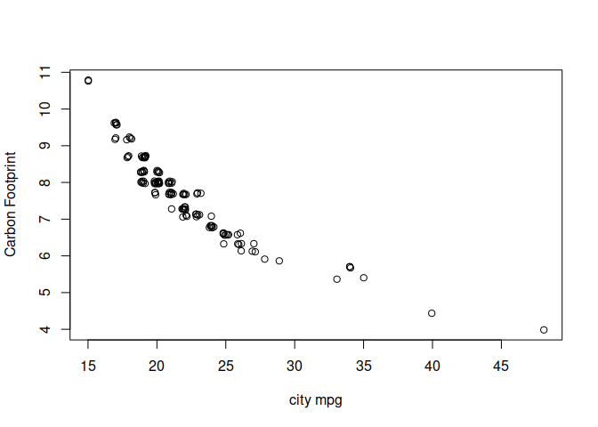

Simple Forecasting
================

- <a href="#trend-and-seasonality" id="toc-trend-and-seasonality">Trend
  and Seasonality</a>
- <a href="#seasonplot" id="toc-seasonplot"><code>seasonplot()</code></a>
- <a href="#monthplot" id="toc-monthplot"><code>monthplot()</code></a>
- <a href="#jitter-plot" id="toc-jitter-plot">Jitter plot</a>
- <a href="#relationship-between-variables-pairs"
  id="toc-relationship-between-variables-pairs">Relationship between
  variables <code>pairs()</code></a>

[Scott Burk](https://www.youtube.com/watch?v=HdYBuDMJ40Y&t=184s)

``` r
library(fpp)
```

    ## Loading required package: forecast

    ## Registered S3 method overwritten by 'quantmod':
    ##   method            from
    ##   as.zoo.data.frame zoo

    ## Loading required package: fma

    ## Loading required package: expsmooth

    ## Loading required package: lmtest

    ## Loading required package: zoo

    ## 
    ## Attaching package: 'zoo'

    ## The following objects are masked from 'package:base':
    ## 
    ##     as.Date, as.Date.numeric

    ## Loading required package: tseries

**The Data**

``` r
str(melsyd)
```

    ##  Time-Series [1:283, 1:3] from 1987 to 1993: 1.91 1.85 1.86 2.14 2.12 ...
    ##  - attr(*, "dimnames")=List of 2
    ##   ..$ : NULL
    ##   ..$ : chr [1:3] "First.Class" "Business.Class" "Economy.Class"

``` r
plot(melsyd[,"Economy.Class"],
     main = "Economy class passengers: Melbourne-Sydney",
     xlab = "Year",
     ylab = "Thousands") 
```

<!-- -->

Note the data gap in 1987 and the 0 values in 1989.

A trend is clear from 1990 to 1992.

No apparent seasonality.

``` r
head(a10, n = -1L)
```

    ##            Jan       Feb       Mar       Apr       May       Jun       Jul
    ## 1991                                                              3.526591
    ## 1992  5.088335  2.814520  2.985811  3.204780  3.127578  3.270523  3.737851
    ## 1993  6.192068  3.450857  3.772307  3.734303  3.905399  4.049687  4.315566
    ## 1994  6.731473  3.841278  4.394076  4.075341  4.540645  4.645615  4.752607
    ## 1995  6.749484  4.216067  4.949349  4.823045  5.194754  5.170787  5.256742
    ## 1996  8.329452  5.069796  5.262557  5.597126  6.110296  5.689161  6.486849
    ## 1997  8.524471  5.277918  5.714303  6.214529  6.411929  6.667716  7.050831
    ## 1998  8.798513  5.918261  6.534493  6.675736  7.064201  7.383381  7.813496
    ## 1999 10.391416  6.421535  8.062619  7.297739  7.936916  8.165323  8.717420
    ## 2000 12.511462  7.457199  8.591191  8.474000  9.386803  9.560399 10.834295
    ## 2001 14.497581  8.049275 10.312891  9.753358 10.850382  9.961719 11.443601
    ## 2002 16.300269  9.053485 10.002449 10.788750 12.106705 10.954101 12.844566
    ## 2003 16.828350  9.800215 10.816994 10.654223 12.512323 12.161210 12.998046
    ## 2004 18.003768 11.938030 12.997900 12.882645 13.943447 13.989472 15.339097
    ## 2005 20.778723 12.154552 13.402392 14.459239 14.795102 15.705248 15.829550
    ## 2006 23.486694 12.536987 15.467018 14.233539 17.783058 16.291602 16.980282
    ## 2007 28.038383 16.763869 19.792754 16.427305 21.000742 20.681002 21.834890
    ## 2008 29.665356 21.654285 18.264945 23.107677 22.912510                    
    ##            Aug       Sep       Oct       Nov       Dec
    ## 1991  3.180891  3.252221  3.611003  3.565869  4.306371
    ## 1992  3.558776  3.777202  3.924490  4.386531  5.810549
    ## 1993  4.562185  4.608662  4.667851  5.093841  7.179962
    ## 1994  5.350605  5.204455  5.301651  5.773742  6.204593
    ## 1995  5.855277  5.490729  6.115293  6.088473  7.416598
    ## 1996  6.300569  6.467476  6.828629  6.649078  8.606937
    ## 1997  6.704919  7.250988  7.819733  7.398101 10.096233
    ## 1998  7.431892  8.275117  8.260441  8.596156 10.558939
    ## 1999  9.070964  9.177113  9.251887  9.933136 11.532974
    ## 2000 10.643751  9.908162 11.710041 11.340151 12.079132
    ## 2001 11.659239 10.647060 12.652134 13.674466 12.965735
    ## 2002 12.196500 12.854748 13.542004 13.287640 15.134918
    ## 2003 12.517276 13.268658 14.733622 13.669382 16.503966
    ## 2004 15.370764 16.142005 16.685754 17.636728 18.869325
    ## 2005 17.554701 18.100864 17.496668 19.347265 20.031291
    ## 2006 18.612189 16.623343 21.430241 23.575517 23.334206
    ## 2007 23.930204 22.930357 23.263340 25.250030 25.806090
    ## 2008

# Trend and Seasonality

``` r
plot(a10,
     ylab = "$ million",
     xlab = "Year",
     main = "Antidiabetic drug sales")
```

<!-- -->

This plot shows both a trend and seasonality

# `seasonplot()`

``` r
seasonplot(a10,
     ylab = "$ million", xlab = "Year",
     main = "Antidiabetic drug sales",
     year.labels = TRUE, year.labels.left = TRUE,
     pch = 19,
     col = 1:20) 
```

<!-- -->

This plot clearly shows the overall upward trend and the fact that each
year exhibits similar monthly patterns. It does show that 2008 was
unusual because it decreased Feb-Mar.

# `monthplot()`

``` r
monthplot(a10,
          ylab = "$ million",
          xlab = "Month",
          xaxt = "n",
          main = "Seasonal deviation plot: ADB Drug Sales")
axis(1, 
     at = 1:12, 
     labels = month.abb, 
     cex = 0.8) # cex here sets the magnification used for x axis
```

<!-- -->

Here we see the mean for each month across the data set. (Not very
interesting in this case.)

# Jitter plot

``` r
plot(jitter(fuel[,5]),
            jitter(fuel[,8]),
            xlab = "city mpg",
            ylab = "Carbon Footprint")
```

<!-- -->

Here the values are offset (jittered) to more easily see the
relationships.

# Relationship between variables `pairs()`

``` r
pairs(fuel[,-c(1:2, 4, 7)], pch = 19)
```

<!-- -->
