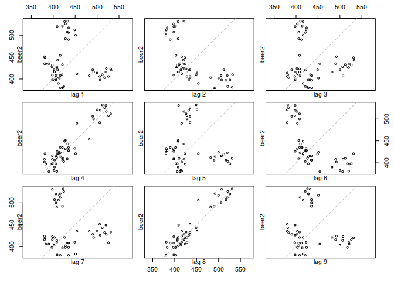
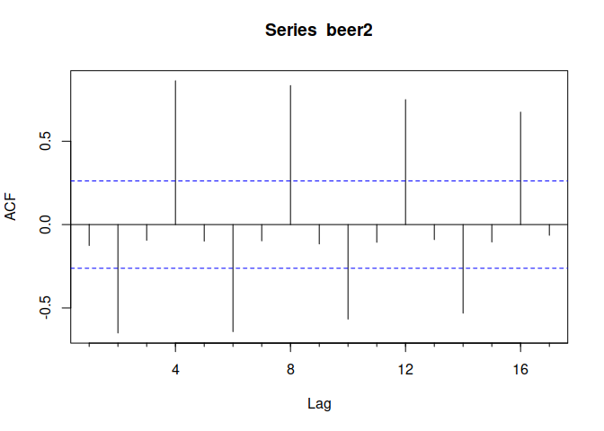
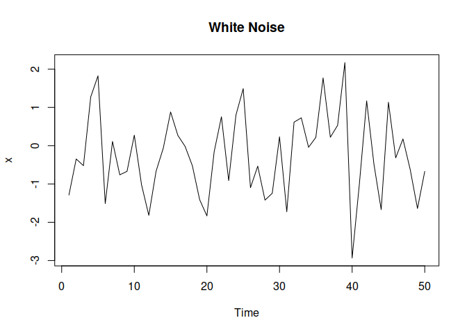
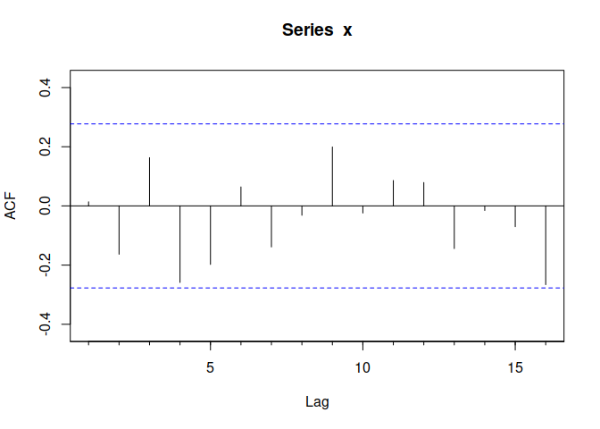

Simple Time Series Forecasting/Univariate, Bivariate and ACF
================

- <a href="#explore-and-prepare-the-data"
  id="toc-explore-and-prepare-the-data">Explore and prepare the data</a>
- <a href="#autocorrelation" id="toc-autocorrelation">Autocorrelation</a>
- <a href="#no-correlation" id="toc-no-correlation">No Correlation</a>

# Explore and prepare the data

``` r
# install.packages("corrplot")
# install.packages("PerformanceAnalytics")
library(fpp)
```

    ## Loading required package: forecast

    ## Registered S3 method overwritten by 'quantmod':
    ##   method            from
    ##   as.zoo.data.frame zoo

    ## Loading required package: fma

    ## Loading required package: expsmooth

    ## Loading required package: lmtest

    ## Loading required package: zoo

    ## 
    ## Attaching package: 'zoo'

    ## The following objects are masked from 'package:base':
    ## 
    ##     as.Date, as.Date.numeric

    ## Loading required package: tseries

``` r
head(fuel)
```

    ##                                      Model Cylinders Litres Barrels City
    ## 20                          Chevrolet Aveo         4    1.6    12.2   25
    ## 21                        Chevrolet Aveo 5         4    1.6    12.2   25
    ## 27                        Chevrolet Cobalt         4    2.2    12.7   24
    ## 120                 Chevrolet Colorado 2WD         4    2.9    17.1   18
    ## 127                 Chevrolet Colorado 2WD         5    3.7    18.0   17
    ## 133 Chevrolet Colorado Cab Chassis inc 2WD         5    3.7    20.1   15
    ##     Highway Cost Carbon
    ## 20       34 1012    6.6
    ## 21       34 1012    6.6
    ## 27       33 1049    6.8
    ## 120      24 1418    9.2
    ## 127      23 1491    9.6
    ## 133      20 1667   10.8

``` r
nrow(fuel)
```

    ## [1] 134

``` r
fuel$Litres 
```

    ##   [1] 1.6 1.6 2.2 2.9 3.7 3.7 2.9 3.7 2.0 2.0 2.4 2.4 2.4 2.4 2.4 2.4 2.4 2.4
    ##  [19] 2.0 2.4 2.4 2.5 2.5 2.0 2.3 2.3 2.9 3.7 3.7 2.9 3.7 2.4 2.4 1.8 1.3 2.4
    ##  [37] 2.4 1.5 1.5 1.6 2.0 2.0 2.4 2.0 2.0 2.4 2.0 2.4 2.4 1.6 2.4 2.0 2.0 2.0
    ##  [55] 2.3 2.3 2.5 2.3 2.5 2.5 2.5 2.5 2.3 2.4 2.4 2.4 2.0 2.4 2.4 2.4 2.5 2.5
    ##  [73] 2.5 2.5 2.5 2.5 1.8 1.8 1.6 1.6 2.2 2.2 2.4 2.4 2.0 2.4 1.8 2.4 2.0 2.0
    ##  [91] 2.0 2.3 2.3 1.8 1.8 2.4 2.4 2.0 2.4 2.4 2.4 2.4 2.4 1.8 2.5 2.4 2.0 2.0
    ## [109] 2.0 2.4 2.4 1.8 2.4 1.8 2.4 1.5 2.5 2.7 1.5 2.5 2.5 2.5 2.5 2.5 2.4 2.5
    ## [127] 2.5 2.4 2.5 2.4 2.5 2.5 2.4 2.5

Let’s look at models with Litres less than 2.0

``` r
fuel2 <- fuel[fuel$Litres<2,]
fuel2
```

    ##                         Model Cylinders Litres Barrels City Highway Cost Carbon
    ## 20             Chevrolet Aveo         4    1.6    12.2   25      34 1012    6.6
    ## 21           Chevrolet Aveo 5         4    1.6    12.2   25      34 1012    6.6
    ## 19                Honda Civic         4    1.8    11.8   25      36  978    6.3
    ## 2          Honda Civic Hybrid         4    1.3     8.2   40      45  675    4.4
    ## 11                  Honda Fit         4    1.5    11.4   27      33  944    6.1
    ## 9                   Honda Fit         4    1.5    11.0   28      35  916    5.9
    ## 13             Hyundai Accent         4    1.6    11.8   26      35  978    6.3
    ## 14                    Kia Rio         4    1.6    11.4   26      35  944    6.1
    ## 12               Nissan Versa         4    1.8    11.8   27      33  978    6.3
    ## 31               Nissan Versa         4    1.8    12.7   24      32 1049    6.8
    ## 22            Pontiac G3 Wave         4    1.6    12.2   25      34 1012    6.6
    ## 23          Pontiac G3 Wave 5         4    1.6    12.2   25      34 1012    6.6
    ## 18               Pontiac Vibe         4    1.8    12.2   26      31 1012    6.6
    ## 33 Saturn Astra 2DR Hatchback         4    1.8    12.7   24      30 1049    6.8
    ## 34 Saturn Astra 4DR Hatchback         4    1.8    12.7   24      30 1049    6.8
    ## 17                   Scion xD         4    1.8    12.2   26      32 1012    6.6
    ## 10             Toyota Corolla         4    1.8    11.4   27      35  944    6.1
    ## 26              Toyota Matrix         4    1.8    12.2   25      31 1012    6.6
    ## 1                Toyota Prius         4    1.5     7.4   48      45  615    4.0
    ## 8                Toyota Yaris         4    1.5    11.0   29      35  916    5.9

``` r
nrow(fuel2)
```

    ## [1] 20

``` r
summary(fuel2[,"Carbon"])
```

    ##    Min. 1st Qu.  Median    Mean 3rd Qu.    Max. 
    ##    4.00    6.10    6.45    6.20    6.60    6.80

Note the difference in Mean and Median suggesting that the data is
skewed left.

``` r
sd(fuel2[,"Carbon"])
```

    ## [1] 0.7440996

``` r
head(ausbeer, n=24L)
```

    ##      Qtr1 Qtr2 Qtr3 Qtr4
    ## 1956  284  213  227  308
    ## 1957  262  228  236  320
    ## 1958  272  233  237  313
    ## 1959  261  227  250  314
    ## 1960  286  227  260  311
    ## 1961  295  233  257  339

# Autocorrelation

``` r
beer2 <- window(ausbeer, 
                start = 1992,
                end = 2006-.1)
lag.plot(beer2, 
         lags = 9, 
         do.lines = FALSE)
```

<!-- -->

This shows positive correlation every fourth season and some negative
correlation with the second prior season.

**`Acf()`**

``` r
Acf(beer2)
```

<!-- -->

This plot clearly shows the negative and positive correlations

# No Correlation

``` r
set.seed(30)
x = ts(rnorm(50))
x
```

    ## Time Series:
    ## Start = 1 
    ## End = 50 
    ## Frequency = 1 
    ##  [1] -1.28851820 -0.34768941 -0.52162885  1.27347316  1.82452060 -1.51130794
    ##  [7]  0.11050805 -0.76079623 -0.66989702  0.27451969 -1.02327202 -1.81939791
    ## [13] -0.66778981 -0.05929799  0.88016591  0.26851292 -0.01957938 -0.52494697
    ## [19] -1.40933143 -1.83398921 -0.15831429  0.75442657 -0.91212962  0.79993114
    ## [25]  1.49055300 -1.09640199 -0.53422069 -1.42120303 -1.24273830  0.23193618
    ## [31] -1.72520250  0.61486070  0.72687514 -0.04219020  0.21600180  1.76973639
    ## [37]  0.22035091  0.53147867  2.16970096 -2.93441824 -0.99556463  1.16955322
    ## [43] -0.48003984 -1.66886763  1.13399719 -0.31759583  0.17585799 -0.62550955
    ## [49] -1.63952782 -0.67148442

``` r
plot(x, main = "White Noise")
```

<!-- -->

``` r
Acf(x)
```

<!-- -->

The bars are $\pm (2/sqrt(t))$ where $t$ is the length of the time
series
