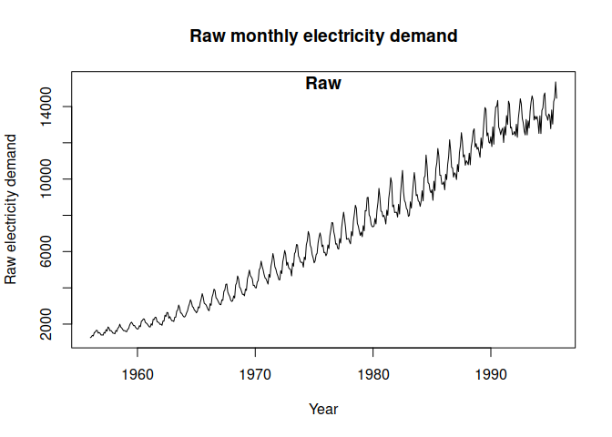
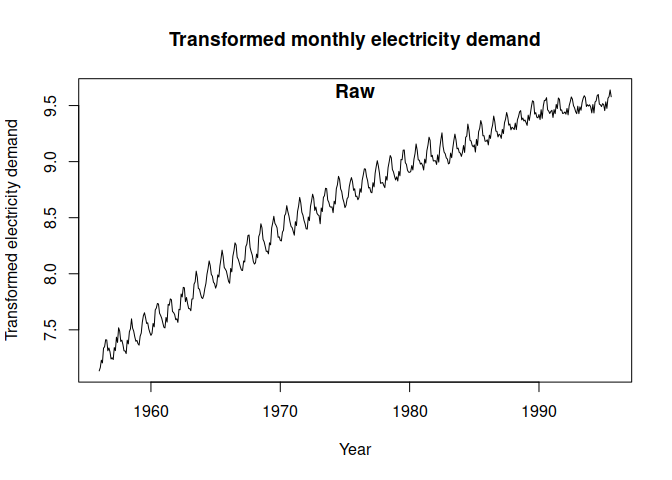
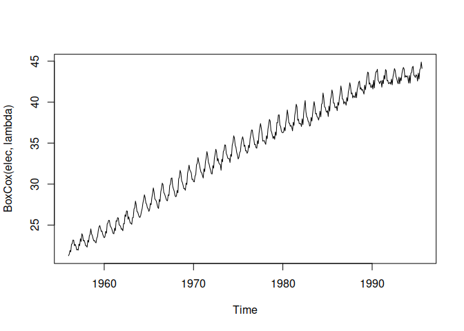
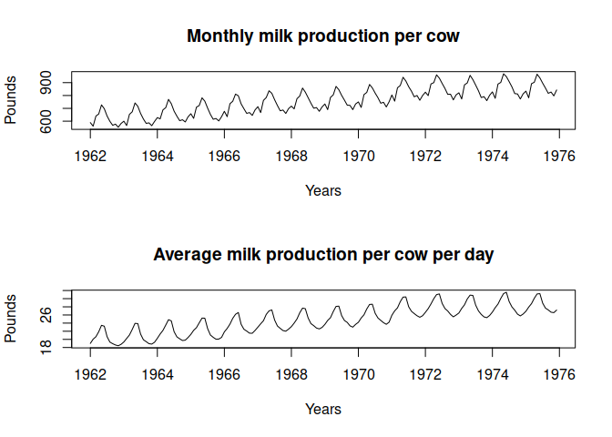

Log and Box-Cox Transforms
================

- <a href="#box-cox-transform" id="toc-box-cox-transform">Box-Cox
  Transform</a>
- <a href="#inverse-or-back-transform"
  id="toc-inverse-or-back-transform">Inverse or Back-Transform</a>
- <a href="#raw-data" id="toc-raw-data">Raw data</a>
- <a href="#log-of-data" id="toc-log-of-data">Log of data</a>
- <a href="#box-cox" id="toc-box-cox">Box-Cox</a>
- <a href="#calendar-adjustments" id="toc-calendar-adjustments">Calendar
  Adjustments</a>
- <a
  href="#population-adjustments-to-account-for-variation-in-population-size"
  id="toc-population-adjustments-to-account-for-variation-in-population-size">Population
  Adjustments to account for variation in population size</a>
- <a href="#inflation-adjustments"
  id="toc-inflation-adjustments">Inflation Adjustments</a>

[Scott Burk’s
Video](https://www.youtube.com/watch?v=HzjolWoxjPI&list=PLX-TyAzMwGs-I3i5uiCin37VFMSy4c50F&index=4)

# Box-Cox Transform

$$w_t = \begin{gather}\begin{cases}log(y_t) & \text{if  }\lambda = 0;\\ (y_t^\lambda-1)/\lambda & \text{otherwise;}\end{cases}\end{gather}$$

# Inverse or Back-Transform

Used to re-scale back to original time series

$$y_t = \begin{gather}\begin{cases}exp(w_t) & \text{if  }\lambda = 0\\(\lambda w_t+1)^{1/\lambda} & \text{otherwise}\end{cases}\end{gather}$$

# Raw data

``` r
library(fpp)
```

    ## Loading required package: forecast

    ## Registered S3 method overwritten by 'quantmod':
    ##   method            from
    ##   as.zoo.data.frame zoo

    ## Loading required package: fma

    ## Loading required package: expsmooth

    ## Loading required package: lmtest

    ## Loading required package: zoo

    ## 
    ## Attaching package: 'zoo'

    ## The following objects are masked from 'package:base':
    ## 
    ##     as.Date, as.Date.numeric

    ## Loading required package: tseries

``` r
plot(elec,
     ylab = "Raw electricity demand",
     xlab = "Year",
     main = "Raw monthly electricity demand")
title(main = "Raw", line = -1)
```

<!-- -->

Notice the increase in variation over time. This is not desirable so we
can use the log.

# Log of data

``` r
plot(log(elec),
     ylab = "Transformed electricity demand",
     xlab = "Year",
     main = "Transformed monthly electricity demand")
title(main = "Raw", line = -1)
```

<!-- -->

This is better but towards the end of the series variability seems to
change

# Box-Cox

We need a lambda. We will let R provide one with `BoxCox.lambda`

``` r
lambda <- BoxCox.lambda(elec) # 0.265
plot(BoxCox(elec, lambda))
```

<!-- -->

# Calendar Adjustments

Take into account eg. workdays, variability in days of the month.

``` r
monthdays <- rep(c(31,28,31,30,31,30,31,31,30,31,30,31),14) # 14 years of data
monthdays[26 + (4*12)*(0:2)] <- 29
par(mfrow = c(2,1))
plot(milk,
     main = "Monthly milk production per cow",
     ylab = "Pounds",
     xlab = "Years")
plot(milk/monthdays,
     main = "Average milk production per cow per day",
     ylab = "Pounds",
     xlab = "Years")
```

<!-- -->

This clearly gives a smoother time series

Other transformations should be used to take into account for example:

# Population Adjustments to account for variation in population size

# Inflation Adjustments
