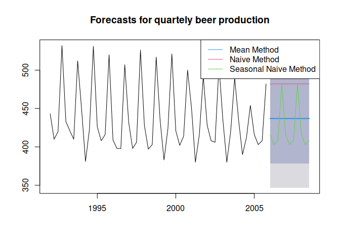
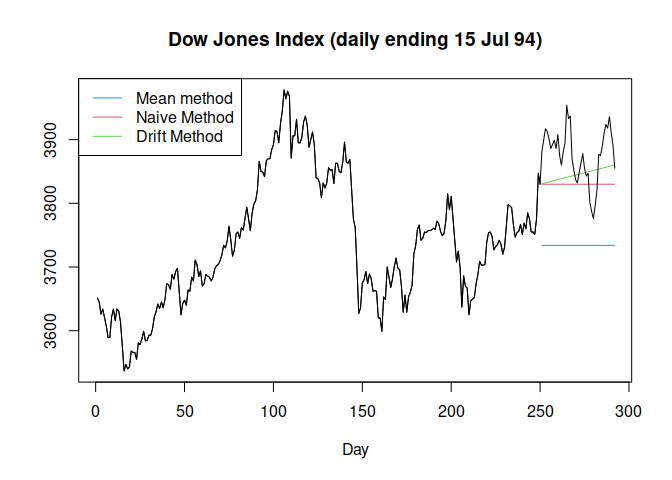

Evaluating Forecast Accuracy
================

- <a href="#forecast-error-statistics"
  id="toc-forecast-error-statistics">Forecast Error Statistics</a>
  - <a href="#forecast-error" id="toc-forecast-error">Forecast Error</a>
  - <a href="#scale-dependent-measures-of-error"
    id="toc-scale-dependent-measures-of-error">Scale Dependent Measures of
    Error</a>
  - <a href="#scale-independent-errors"
    id="toc-scale-independent-errors">Scale Independent Errors</a>
  - <a href="#scale-independent-scaled-error"
    id="toc-scale-independent-scaled-error">Scale Independent, Scaled
    Error</a>

[Scott Burk’s
Video](https://www.youtube.com/watch?v=PvaKMQBR6nA&list=PLX-TyAzMwGs-I3i5uiCin37VFMSy4c50F&index=5)

# Forecast Error Statistics

## Forecast Error

$$e_i=y_i-\hat{y_i}$$ $$\hat{y} = prediction$$

## Scale Dependent Measures of Error

<p class="text-center">
Mean Absolute Error
</p>
$$MAE = mean(|e_i|)$$
<p class="text-center">
Root Mean Absolute Error
</p>

$$RMSE=\sqrt(mean(e_i^2))$$

## Scale Independent Errors

Careful that $y$ is meaningful and not zero

<p class="text-center">
Percentage Errors
</p>
$$p_i = 100e_i/y_i$$
<p class="text-center">
Mean Absolute Percentage Error
</p>

$$MAPE=mean(|p_i|)$$

## Scale Independent, Scaled Error

<p class="text-center">
Mean Absolute Scaled Error
</p>
$$MASE=mean(|q_t|)$$
<p class="text-center">
Where
</p>

$$q_t = \frac{e_t}{\frac{1}{n-1}\sum_{i=2}^n|y_i-y_{i-1}|}$$

``` r
library(fpp)
```

    ## Loading required package: forecast

    ## Registered S3 method overwritten by 'quantmod':
    ##   method            from
    ##   as.zoo.data.frame zoo

    ## Loading required package: fma

    ## Loading required package: expsmooth

    ## Loading required package: lmtest

    ## Loading required package: zoo

    ## 
    ## Attaching package: 'zoo'

    ## The following objects are masked from 'package:base':
    ## 
    ##     as.Date, as.Date.numeric

    ## Loading required package: tseries

``` r
beer2 <- window(ausbeer, 
                start = 1992,
                end = 2006-.1)
beerfit1 <- meanf(beer2, h=11)
beerfit2 <- naive(beer2, h=11)
beerfit3 <- snaive(beer2, h=11)

plot(beerfit1,
     main = "Forecasts for quartely beer production")
lines(beerfit2$mean, col = 2)
lines(beerfit3$mean, col = 3)
legend("topright", 
       lty = 1,
       col = c(4,2,3),
       legend = c("Mean Method", "Naive Method", "Seasonal Naive Method"))
```

<!-- -->

``` r
beer3 <- window(ausbeer, start = 2006)
accuracy(beerfit1, beer3)
```

    ##                         ME     RMSE      MAE        MPE     MAPE     MASE
    ## Training set  8.121418e-15 44.17630 35.91135 -0.9510944 7.995509 2.444228
    ## Test set     -1.718344e+01 38.01454 33.77760 -4.7345524 8.169955 2.298999
    ##                     ACF1 Theil's U
    ## Training set -0.12566970        NA
    ## Test set     -0.08286364 0.7901651

``` r
accuracy(beerfit2, beer3)
```

    ##                       ME     RMSE      MAE         MPE     MAPE     MASE
    ## Training set   0.7090909 66.60207 55.43636  -0.8987351 12.26632 3.773156
    ## Test set     -62.2727273 70.90647 63.90909 -15.5431822 15.87645 4.349833
    ##                     ACF1 Theil's U
    ## Training set -0.25475212        NA
    ## Test set     -0.08286364  1.428524

``` r
accuracy(beerfit3, beer3)
```

    ##                     ME     RMSE      MAE        MPE     MAPE      MASE
    ## Training set -1.846154 17.24261 14.69231 -0.4803931 3.401224 1.0000000
    ## Test set     -2.545455 12.96849 11.27273 -0.7530978 2.729847 0.7672537
    ##                    ACF1 Theil's U
    ## Training set -0.3408329        NA
    ## Test set     -0.1786912   0.22573

``` r
dj2 <- window(dj, end = 250)

plot(dj2,
     main = "Dow Jones Index (daily ending 15 Jul 94)",
     ylab = "",
     xlab = "Day",
     xlim = c(2, 290))
lines(meanf(dj2, h=42)$mean, col = 4)
lines(rwf(dj2, h=42)$mean, col = 2)
lines(rwf(dj2, drift=TRUE, h=42)$mean, col = 3)
legend("topleft",
       lty = 1,
       col = c(4,2,3),
       legend = c("Mean method", "Naive Method", "Drift Method"))
lines(dj)
```

<!-- -->

``` r
dj3 <- window(dj, start=251)
accuracy(meanf(dj2,h=42), dj3)
```

    ##                        ME      RMSE       MAE         MPE     MAPE     MASE
    ## Training set 6.553874e-14  98.71439  80.56688 -0.06934572 2.151962 4.920567
    ## Test set     1.424185e+02 148.23574 142.41848  3.66304611 3.663046 8.698111
    ##                   ACF1 Theil's U
    ## Training set 0.9719593        NA
    ## Test set     0.8255136  6.072223

``` r
accuracy(rwf(dj2,h=42), dj3)
```

    ##                      ME     RMSE      MAE        MPE      MAPE     MASE
    ## Training set  0.7188755 22.00014 16.37349 0.01749683 0.4380973 1.000000
    ## Test set     46.4404762 62.02846 54.44048 1.18683463 1.3979371 3.324915
    ##                    ACF1 Theil's U
    ## Training set 0.02446257        NA
    ## Test set     0.82551365   2.54582

``` r
accuracy(rwf(dj2, drift = TRUE, h = 42), dj3)
```

    ##                        ME     RMSE      MAE          MPE      MAPE      MASE
    ## Training set 1.278395e-13 21.98839 16.34525 -0.001766862 0.4373707 0.9982752
    ## Test set     3.098465e+01 53.69767 45.72743  0.787547945 1.1757748 2.7927719
    ##                    ACF1 Theil's U
    ## Training set 0.02446257        NA
    ## Test set     0.83881869  2.203742
