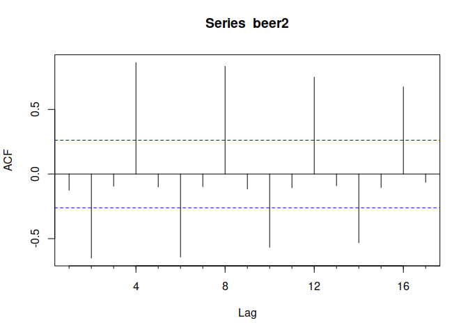

Simple Time Series Forecasting/Univariate, Bivariate and ACF
================

# Explore and prepare the data

``` r
# install.packages("corrplot")
# install.packages("PerformanceAnalytics")
library(fpp)
```

    ## Loading required package: forecast

    ## Registered S3 method overwritten by 'quantmod':
    ##   method            from
    ##   as.zoo.data.frame zoo

    ## Loading required package: fma

    ## Loading required package: expsmooth

    ## Loading required package: lmtest

    ## Loading required package: zoo

    ## 
    ## Attaching package: 'zoo'

    ## The following objects are masked from 'package:base':
    ## 
    ##     as.Date, as.Date.numeric

    ## Loading required package: tseries

``` r
fuel
```

    ##                                      Model Cylinders Litres Barrels City
    ## 20                          Chevrolet Aveo         4    1.6    12.2   25
    ## 21                        Chevrolet Aveo 5         4    1.6    12.2   25
    ## 27                        Chevrolet Cobalt         4    2.2    12.7   24
    ## 120                 Chevrolet Colorado 2WD         4    2.9    17.1   18
    ## 127                 Chevrolet Colorado 2WD         5    3.7    18.0   17
    ## 133 Chevrolet Colorado Cab Chassis inc 2WD         5    3.7    20.1   15
    ## 121        Chevrolet Colorado Crew Cab 2WD         4    2.9    17.1   18
    ## 128        Chevrolet Colorado Crew Cab 2WD         5    3.7    18.0   17
    ## 95                       Chevrolet HHR FWD         4    2.0    14.9   19
    ## 96                 Chevrolet HHR Panel FWD         4    2.0    14.9   19
    ## 43                        Chevrolet Malibu         4    2.4    13.2   22
    ## 48                        Chevrolet Malibu         4    2.4    13.7   22
    ## 15                 Chevrolet Malibu Hybrid         4    2.4    11.8   26
    ## 113                    Chrysler PT Cruiser         4    2.4    16.3   19
    ## 122                    Chrysler PT Cruiser         4    2.4    16.3   18
    ## 60                        Chrysler Sebring         4    2.4    14.3   21
    ## 74            Chrysler Sebring Convertible         4    2.4    14.9   20
    ## 61                           Dodge Avenger         4    2.4    14.3   21
    ## 40                           Dodge Caliber         4    2.0    14.3   23
    ## 71                           Dodge Caliber         4    2.4    14.9   21
    ## 110                      Dodge Journey 2WD         4    2.4    16.3   19
    ## 79                         Ford Escape FWD         4    2.5    14.9   20
    ## 4                   Ford Escape Hybrid FWD         4    2.5    10.7   34
    ## 28                          Ford Focus FWD         4    2.0    12.7   24
    ## 80                         Ford Fusion FWD         4    2.3    14.9   20
    ## 114                 Ford Ranger Pickup 2WD         4    2.3    16.3   19
    ## 123                         GMC Canyon 2WD         4    2.9    17.1   18
    ## 129                         GMC Canyon 2WD         5    3.7    18.0   17
    ## 134         GMC Canyon Cab Chassis Inc 2WD         5    3.7    20.1   15
    ## 124                GMC Canyon Crew Cab 2WD         4    2.9    17.1   18
    ## 130                GMC Canyon Crew Cab 2WD         5    3.7    18.0   17
    ## 62                            Honda Accord         4    2.4    14.3   21
    ## 63                      Honda Accord Coupe         4    2.4    14.3   21
    ## 19                             Honda Civic         4    1.8    11.8   25
    ## 2                       Honda Civic Hybrid         4    1.3     8.2   40
    ## 88                          Honda CR-V 2WD         4    2.4    14.9   20
    ## 91                       Honda Element 2WD         4    2.4    15.6   20
    ## 11                               Honda Fit         4    1.5    11.4   27
    ## 9                                Honda Fit         4    1.5    11.0   28
    ## 13                          Hyundai Accent         4    1.6    11.8   26
    ## 24                         Hyundai Elantra         4    2.0    12.2   25
    ## 39                 Hyundai Elantra Touring         4    2.0    13.2   23
    ## 46                          Hyundai Sonata         4    2.4    13.7   22
    ## 92                      Hyundai Tucson 2WD         4    2.0    15.6   20
    ## 41                        Jeep Compass 2WD         4    2.0    14.3   23
    ## 72                        Jeep Compass 2WD         4    2.4    14.9   21
    ## 42                        Jeep Patriot 2WD         4    2.0    14.3   23
    ## 73                        Jeep Patriot 2WD         4    2.4    14.9   21
    ## 47                              Kia Optima         4    2.4    13.7   22
    ## 14                                 Kia Rio         4    1.6    11.4   26
    ## 89                               Kia Rondo         4    2.4    15.6   20
    ## 30                             Kia Spectra         4    2.0    12.7   24
    ## 93                        Kia Sportage 2WD         4    2.0    15.6   20
    ## 49                                 Mazda 3         4    2.0    13.7   22
    ## 54                                 Mazda 3         4    2.3    14.3   22
    ## 68                                 Mazda 5         4    2.3    14.9   21
    ## 64                                 Mazda 6         4    2.5    14.3   21
    ## 115                        Mazda B2300 2WD         4    2.3    16.3   19
    ## 81                       Mazda Tribute FWD         4    2.5    14.9   20
    ## 5                 Mazda Tribute Hybrid 2WD         4    2.5    10.7   34
    ## 82                     Mercury Mariner FWD         4    2.5    14.9   20
    ## 6               Mercury Mariner Hybrid FWD         4    2.5    10.7   34
    ## 83                           Mercury Milan         4    2.3    14.9   20
    ## 107                     Mitsubishi Eclipse         4    2.4    15.6   19
    ## 108              Mitsubishi Eclipse Spyder         4    2.4    15.6   19
    ## 90                       Mitsubishi Galant         4    2.4    14.9   20
    ## 55                       Mitsubishi Lancer         4    2.0    14.3   22
    ## 69                       Mitsubishi Lancer         4    2.4    14.9   21
    ## 70             Mitsubishi Lancer Sportback         4    2.4    14.9   21
    ## 94                Mitsubishi Outlander 2WD         4    2.4    15.6   20
    ## 36                           Nissan Altima         4    2.5    13.2   23
    ## 37                     Nissan Altima Coupe         4    2.5    13.2   23
    ## 3                     Nissan Altima Hybrid         4    2.5    10.1   35
    ## 131                    Nissan Frontier 2WD         4    2.5    18.0   17
    ## 58                        Nissan Rogue FWD         4    2.5    14.3   22
    ## 32                           Nissan Sentra         4    2.5    13.2   24
    ## 12                            Nissan Versa         4    1.8    11.8   27
    ## 31                            Nissan Versa         4    1.8    12.7   24
    ## 22                         Pontiac G3 Wave         4    1.6    12.2   25
    ## 23                       Pontiac G3 Wave 5         4    1.6    12.2   25
    ## 29                              Pontiac G5         4    2.2    12.7   24
    ## 35                           Pontiac G5 GT         4    2.2    13.2   23
    ## 44                              Pontiac G6         4    2.4    13.2   22
    ## 50                              Pontiac G6         4    2.4    13.7   22
    ## 102                       Pontiac Solstice         4    2.0    16.3   19
    ## 116                       Pontiac Solstice         4    2.4    16.3   19
    ## 18                            Pontiac Vibe         4    1.8    12.2   26
    ## 65                            Pontiac Vibe         4    2.4    14.3   21
    ## 103                   Saab 9-3 Convertible         4    2.0    15.6   19
    ## 97                    Saab 9-3 Sport Sedan         4    2.0    15.6   19
    ## 104                    Saab 9-3 SportCombi         4    2.0    15.6   19
    ## 125                         Saab 9-5 Sedan         4    2.3    17.1   17
    ## 126                    Saab 9-5 SportCombi         4    2.3    17.1   17
    ## 33              Saturn Astra 2DR Hatchback         4    1.8    12.7   24
    ## 34              Saturn Astra 4DR Hatchback         4    1.8    12.7   24
    ## 45                             Saturn Aura         4    2.4    13.2   22
    ## 16                      Saturn Aura Hybrid         4    2.4    11.8   26
    ## 105                             Saturn SKY         4    2.0    16.3   19
    ## 117                             Saturn SKY         4    2.4    16.3   19
    ## 109                         Saturn Vue FWD         4    2.4    15.6   19
    ## 25                       Saturn Vue Hybrid         4    2.4    12.2   25
    ## 66                                Scion tC         4    2.4    14.3   21
    ## 56                                Scion xB         4    2.4    14.3   22
    ## 17                                Scion xD         4    1.8    12.2   26
    ## 132                     Suzuki Equator 2WD         4    2.5    18.0   17
    ## 111                    Suzuki Grand Vitara         4    2.4    16.3   19
    ## 51                              Suzuki SX4         4    2.0    13.7   22
    ## 38                        Suzuki SX4 Sedan         4    2.0    13.2   23
    ## 52                        Suzuki SX4 Sport         4    2.0    13.7   22
    ## 59                            Toyota Camry         4    2.4    13.7   21
    ## 7                      Toyota Camry Hybrid         4    2.4    10.1   33
    ## 10                          Toyota Corolla         4    1.8    11.4   27
    ## 53                          Toyota Corolla         4    2.4    13.7   22
    ## 26                           Toyota Matrix         4    1.8    12.2   25
    ## 67                           Toyota Matrix         4    2.4    14.3   21
    ## 1                             Toyota Prius         4    1.5     7.4   48
    ## 57                         Toyota RAV4 2WD         4    2.5    14.3   22
    ## 112                      Toyota Tacoma 2WD         4    2.7    16.3   19
    ## 8                             Toyota Yaris         4    1.5    11.0   29
    ## 75                        Volkswagen Jetta         5    2.5    14.3   20
    ## 76             Volkswagen Jetta SportWagen         5    2.5    14.3   20
    ## 77                   Volkswagen New Beetle         5    2.5    14.9   20
    ## 84       Volkswagen New Beetle Convertible         5    2.5    14.9   20
    ## 78                       Volkswagen Rabbit         5    2.5    14.3   20
    ## 85                           Volvo C30 FWD         5    2.4    14.9   20
    ## 98                           Volvo C30 FWD         5    2.5    14.9   19
    ## 118                  Volvo C70 Convertible         5    2.5    16.3   18
    ## 86                           Volvo S40 FWD         5    2.4    14.9   20
    ## 99                           Volvo S40 FWD         5    2.5    14.9   19
    ## 119                          Volvo S60 FWD         5    2.4    16.3   18
    ## 100                          Volvo S60 FWD         5    2.5    14.9   19
    ## 106                          Volvo S60 FWD         5    2.5    15.6   19
    ## 87                           Volvo V50 FWD         5    2.4    14.9   20
    ## 101                          Volvo V50 FWD         5    2.5    14.9   19
    ##     Highway Cost Carbon
    ## 20       34 1012    6.6
    ## 21       34 1012    6.6
    ## 27       33 1049    6.8
    ## 120      24 1418    9.2
    ## 127      23 1491    9.6
    ## 133      20 1667   10.8
    ## 121      24 1418    9.2
    ## 128      23 1491    9.6
    ## 95       29 1233    8.0
    ## 96       29 1233    8.0
    ## 43       33 1091    7.1
    ## 48       30 1134    7.3
    ## 15       34  978    6.3
    ## 113      24 1349    8.7
    ## 122      24 1349    8.7
    ## 60       30 1182    7.7
    ## 74       29 1233    8.0
    ## 61       30 1182    7.7
    ## 40       27 1182    7.7
    ## 71       25 1233    8.0
    ## 110      25 1349    8.7
    ## 79       28 1233    8.0
    ## 4        31  887    5.7
    ## 28       33 1049    6.8
    ## 80       28 1233    8.0
    ## 114      24 1349    8.7
    ## 123      24 1418    9.2
    ## 129      23 1491    9.6
    ## 134      20 1667   10.8
    ## 124      24 1418    9.2
    ## 130      23 1491    9.6
    ## 62       30 1182    7.7
    ## 63       30 1182    7.7
    ## 19       36  978    6.3
    ## 2        45  675    4.4
    ## 88       27 1233    8.0
    ## 91       25 1290    8.3
    ## 11       33  944    6.1
    ## 9        35  916    5.9
    ## 13       35  978    6.3
    ## 24       33 1012    6.6
    ## 39       30 1091    7.1
    ## 46       32 1134    7.3
    ## 92       25 1290    8.3
    ## 41       27 1182    7.7
    ## 72       25 1233    8.0
    ## 42       27 1182    7.7
    ## 73       25 1233    8.0
    ## 47       32 1134    7.3
    ## 14       35  944    6.1
    ## 89       27 1290    8.3
    ## 30       32 1049    6.8
    ## 93       25 1290    8.3
    ## 49       30 1134    7.3
    ## 54       28 1182    7.7
    ## 68       27 1233    8.0
    ## 64       30 1182    7.7
    ## 115      24 1349    8.7
    ## 81       28 1233    8.0
    ## 5        31  887    5.7
    ## 82       28 1233    8.0
    ## 6        31  887    5.7
    ## 83       28 1233    8.0
    ## 107      26 1290    8.3
    ## 108      26 1290    8.3
    ## 90       27 1233    8.0
    ## 55       28 1182    7.7
    ## 69       27 1233    8.0
    ## 70       27 1233    8.0
    ## 94       25 1290    8.3
    ## 36       31 1091    7.1
    ## 37       31 1091    7.1
    ## 3        33  833    5.4
    ## 131      22 1491    9.6
    ## 58       27 1182    7.7
    ## 32       30 1091    7.1
    ## 12       33  978    6.3
    ## 31       32 1049    6.8
    ## 22       34 1012    6.6
    ## 23       34 1012    6.6
    ## 29       33 1049    6.8
    ## 35       32 1091    7.1
    ## 44       33 1091    7.1
    ## 50       30 1134    7.3
    ## 102      27 1349    8.7
    ## 116      24 1349    8.7
    ## 18       31 1012    6.6
    ## 65       29 1182    7.7
    ## 103      27 1290    8.3
    ## 97       28 1290    8.3
    ## 104      27 1290    8.3
    ## 125      27 1418    9.2
    ## 126      27 1418    9.2
    ## 33       30 1049    6.8
    ## 34       30 1049    6.8
    ## 45       33 1091    7.1
    ## 16       34  978    6.3
    ## 105      27 1349    8.7
    ## 117      24 1349    8.7
    ## 109      26 1290    8.3
    ## 25       32 1012    6.6
    ## 66       29 1182    7.7
    ## 56       28 1182    7.7
    ## 17       32 1012    6.6
    ## 132      22 1491    9.6
    ## 111      25 1349    8.7
    ## 51       30 1134    7.3
    ## 38       31 1091    7.1
    ## 52       30 1134    7.3
    ## 59       31 1134    7.3
    ## 7        34  833    5.4
    ## 10       35  944    6.1
    ## 53       30 1134    7.3
    ## 26       31 1012    6.6
    ## 67       29 1182    7.7
    ## 1        45  615    4.0
    ## 57       28 1182    7.7
    ## 112      25 1349    8.7
    ## 8        35  916    5.9
    ## 75       29 1182    7.7
    ## 76       29 1182    7.7
    ## 77       29 1233    8.0
    ## 84       28 1233    8.0
    ## 78       29 1182    7.7
    ## 85       28 1233    8.0
    ## 98       28 1233    8.0
    ## 118      26 1349    8.7
    ## 86       28 1233    8.0
    ## 99       28 1233    8.0
    ## 119      26 1349    8.7
    ## 100      28 1233    8.0
    ## 106      27 1290    8.3
    ## 87       28 1233    8.0
    ## 101      28 1233    8.0

``` r
nrow(fuel)
```

    ## [1] 134

``` r
fuel$Litres 
```

    ##   [1] 1.6 1.6 2.2 2.9 3.7 3.7 2.9 3.7 2.0 2.0 2.4 2.4 2.4 2.4 2.4 2.4 2.4 2.4
    ##  [19] 2.0 2.4 2.4 2.5 2.5 2.0 2.3 2.3 2.9 3.7 3.7 2.9 3.7 2.4 2.4 1.8 1.3 2.4
    ##  [37] 2.4 1.5 1.5 1.6 2.0 2.0 2.4 2.0 2.0 2.4 2.0 2.4 2.4 1.6 2.4 2.0 2.0 2.0
    ##  [55] 2.3 2.3 2.5 2.3 2.5 2.5 2.5 2.5 2.3 2.4 2.4 2.4 2.0 2.4 2.4 2.4 2.5 2.5
    ##  [73] 2.5 2.5 2.5 2.5 1.8 1.8 1.6 1.6 2.2 2.2 2.4 2.4 2.0 2.4 1.8 2.4 2.0 2.0
    ##  [91] 2.0 2.3 2.3 1.8 1.8 2.4 2.4 2.0 2.4 2.4 2.4 2.4 2.4 1.8 2.5 2.4 2.0 2.0
    ## [109] 2.0 2.4 2.4 1.8 2.4 1.8 2.4 1.5 2.5 2.7 1.5 2.5 2.5 2.5 2.5 2.5 2.4 2.5
    ## [127] 2.5 2.4 2.5 2.4 2.5 2.5 2.4 2.5

Let’s look at models with Litres less than 2.0

``` r
fuel2 <- fuel[fuel$Litres<2,]
fuel2
```

    ##                         Model Cylinders Litres Barrels City Highway Cost Carbon
    ## 20             Chevrolet Aveo         4    1.6    12.2   25      34 1012    6.6
    ## 21           Chevrolet Aveo 5         4    1.6    12.2   25      34 1012    6.6
    ## 19                Honda Civic         4    1.8    11.8   25      36  978    6.3
    ## 2          Honda Civic Hybrid         4    1.3     8.2   40      45  675    4.4
    ## 11                  Honda Fit         4    1.5    11.4   27      33  944    6.1
    ## 9                   Honda Fit         4    1.5    11.0   28      35  916    5.9
    ## 13             Hyundai Accent         4    1.6    11.8   26      35  978    6.3
    ## 14                    Kia Rio         4    1.6    11.4   26      35  944    6.1
    ## 12               Nissan Versa         4    1.8    11.8   27      33  978    6.3
    ## 31               Nissan Versa         4    1.8    12.7   24      32 1049    6.8
    ## 22            Pontiac G3 Wave         4    1.6    12.2   25      34 1012    6.6
    ## 23          Pontiac G3 Wave 5         4    1.6    12.2   25      34 1012    6.6
    ## 18               Pontiac Vibe         4    1.8    12.2   26      31 1012    6.6
    ## 33 Saturn Astra 2DR Hatchback         4    1.8    12.7   24      30 1049    6.8
    ## 34 Saturn Astra 4DR Hatchback         4    1.8    12.7   24      30 1049    6.8
    ## 17                   Scion xD         4    1.8    12.2   26      32 1012    6.6
    ## 10             Toyota Corolla         4    1.8    11.4   27      35  944    6.1
    ## 26              Toyota Matrix         4    1.8    12.2   25      31 1012    6.6
    ## 1                Toyota Prius         4    1.5     7.4   48      45  615    4.0
    ## 8                Toyota Yaris         4    1.5    11.0   29      35  916    5.9

``` r
nrow(fuel2)
```

    ## [1] 20

``` r
summary(fuel2[,"Carbon"])
```

    ##    Min. 1st Qu.  Median    Mean 3rd Qu.    Max. 
    ##    4.00    6.10    6.45    6.20    6.60    6.80

Note the difference in Mean and Median suggesting that the data is
skewed left

``` r
sd(fuel2[,"Carbon"])
```

    ## [1] 0.7440996

``` r
ausbeer
```

    ##      Qtr1 Qtr2 Qtr3 Qtr4
    ## 1956  284  213  227  308
    ## 1957  262  228  236  320
    ## 1958  272  233  237  313
    ## 1959  261  227  250  314
    ## 1960  286  227  260  311
    ## 1961  295  233  257  339
    ## 1962  279  250  270  346
    ## 1963  294  255  278  363
    ## 1964  313  273  300  370
    ## 1965  331  288  306  386
    ## 1966  335  288  308  402
    ## 1967  353  316  325  405
    ## 1968  393  319  327  442
    ## 1969  383  332  361  446
    ## 1970  387  357  374  466
    ## 1971  410  370  379  487
    ## 1972  419  378  393  506
    ## 1973  458  387  427  565
    ## 1974  465  445  450  556
    ## 1975  500  452  435  554
    ## 1976  510  433  453  548
    ## 1977  486  453  457  566
    ## 1978  515  464  431  588
    ## 1979  503  443  448  555
    ## 1980  513  427  473  526
    ## 1981  548  440  469  575
    ## 1982  493  433  480  576
    ## 1983  475  405  435  535
    ## 1984  453  430  417  552
    ## 1985  464  417  423  554
    ## 1986  459  428  429  534
    ## 1987  481  416  440  538
    ## 1988  474  440  447  598
    ## 1989  467  439  446  567
    ## 1990  485  441  429  599
    ## 1991  464  424  436  574
    ## 1992  443  410  420  532
    ## 1993  433  421  410  512
    ## 1994  449  381  423  531
    ## 1995  426  408  416  520
    ## 1996  409  398  398  507
    ## 1997  432  398  406  526
    ## 1998  428  397  403  517
    ## 1999  435  383  424  521
    ## 2000  421  402  414  500
    ## 2001  451  380  416  492
    ## 2002  428  408  406  506
    ## 2003  435  380  421  490
    ## 2004  435  390  412  454
    ## 2005  416  403  408  482
    ## 2006  438  386  405  491
    ## 2007  427  383  394  473
    ## 2008  420  390  410

# Autocorrelation

``` r
beer2 <- window(ausbeer, 
                start = 1992,
                end = 2006-.1)
lag.plot(beer2, 
         lags = 9, 
         do.lines = FALSE)
```

<!-- -->
This shows positive correlation every fourth season and some negative
correlation with the second prior season.

**`Acf()`**

``` r
Acf(beer2)
```

<!-- -->
This plot clearly shows the negative and positive correlations

# No Correlation

``` r
set.seed(30)
x = ts(rnorm(50))
x
```

    ## Time Series:
    ## Start = 1 
    ## End = 50 
    ## Frequency = 1 
    ##  [1] -1.28851820 -0.34768941 -0.52162885  1.27347316  1.82452060 -1.51130794
    ##  [7]  0.11050805 -0.76079623 -0.66989702  0.27451969 -1.02327202 -1.81939791
    ## [13] -0.66778981 -0.05929799  0.88016591  0.26851292 -0.01957938 -0.52494697
    ## [19] -1.40933143 -1.83398921 -0.15831429  0.75442657 -0.91212962  0.79993114
    ## [25]  1.49055300 -1.09640199 -0.53422069 -1.42120303 -1.24273830  0.23193618
    ## [31] -1.72520250  0.61486070  0.72687514 -0.04219020  0.21600180  1.76973639
    ## [37]  0.22035091  0.53147867  2.16970096 -2.93441824 -0.99556463  1.16955322
    ## [43] -0.48003984 -1.66886763  1.13399719 -0.31759583  0.17585799 -0.62550955
    ## [49] -1.63952782 -0.67148442

``` r
plot(x, main = "White Noise")
```

<!-- -->

``` r
Acf(x)
```

<!-- -->
The bars are $\pm (2/sqrt(t))$ where $t$ is the length of the time
series
