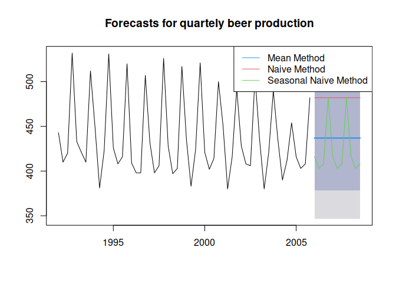
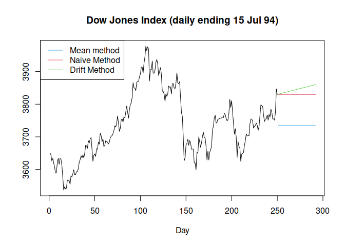

Simple Forcast Methods (Average, Naive, Seasonal Naive, Drift)
================

``` r
library(fpp)
```

    ## Loading required package: forecast

    ## Registered S3 method overwritten by 'quantmod':
    ##   method            from
    ##   as.zoo.data.frame zoo

    ## Loading required package: fma

    ## Loading required package: expsmooth

    ## Loading required package: lmtest

    ## Loading required package: zoo

    ## 
    ## Attaching package: 'zoo'

    ## The following objects are masked from 'package:base':
    ## 
    ##     as.Date, as.Date.numeric

    ## Loading required package: tseries

# Mean Forecast

**`meanf(y, h)`**

Requires `y` for the dataset and `h` for the number of periods for
forecasting

# Naive Method

**`naive(y, h)`**

**`rwf(y, h`**

Only appropriate for time series data. Uses last observed value for
forecast. This works well for economic/financial time series.

# Seasonal Naive Method

**`snaive(y, h)`**

Uses observed value from one year prior

# Drift Method

`rwf(y, h, drift=TRUE`

``` r
beer2 <- window(ausbeer, 
                start = 1992,
                end = 2006-.1)
beerfit1 <- meanf(beer2, h=11)
beerfit2 <- naive(beer2, h=11)
beerfit3 <- snaive(beer2, h=11)
```

``` r
plot(beerfit1,
     main = "Forecasts for quartely beer production")
lines(beerfit2$mean, col = 2)
lines(beerfit3$mean, col = 3)
legend("topright", 
       lty = 1,
       col = c(4,2,3),
       legend = c("Mean Method", "Naive Method", "Seasonal Naive Method"))
```

<!-- -->

``` r
dj2 <- window(dj, end = 250)

plot(dj2,
     main = "Dow Jones Index (daily ending 15 Jul 94)",
     ylab = "",
     xlab = "Day",
     xlim = c(2, 290))
lines(meanf(dj2, h=42)$mean, col = 4)
lines(rwf(dj2, h=42)$mean, col = 2)
lines(rwf(dj2, drift=TRUE, h=42)$mean, col = 3)
legend("topleft",
       lty = 1,
       col = c(4,2,3),
       legend = c("Mean method", "Naive Method", "Drift Method"))
```

<!-- -->
