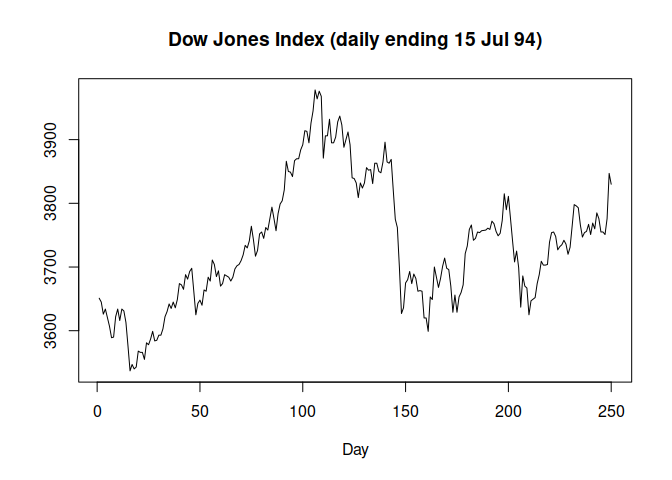
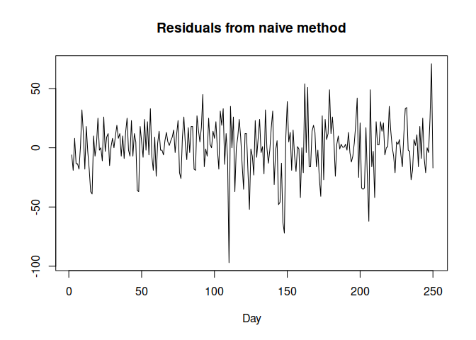
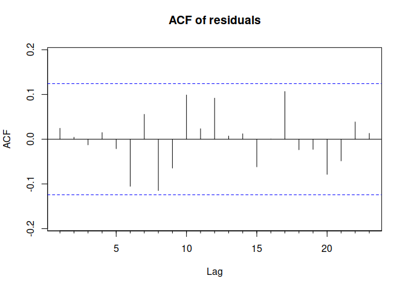
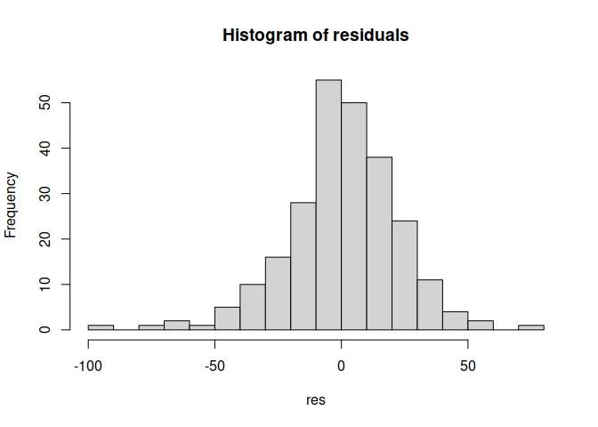

Residual Diagnostics
================

[Scott Burk’s
Video](https://www.youtube.com/watch?v=IGlEaak2Lfo&list=PLX-TyAzMwGs-I3i5uiCin37VFMSy4c50F&index=6)

- Forecast Error (Residual)

$$e_i = y_i - \hat{y}_i$$

- Essential Forecasting Method
  - Residuals are uncorrelated
  - Residuals have zero mean

$$e_i \sim i.i.d.(0,)$$

(i.i.d.: independently identically distributed)

- Essential and Useful:
  - Residuals have constant variance
  - Residuals are Normally distributed

$$e_i \sim i.i.d. N(0,\sigma^2)$$

- Random Walk, Naive Method:

$$e_t=y_t-\hat{y}_t=y_t-y_{t-1}$$

``` r
library(fpp)
```

    ## Loading required package: forecast

    ## Registered S3 method overwritten by 'quantmod':
    ##   method            from
    ##   as.zoo.data.frame zoo

    ## Loading required package: fma

    ## Loading required package: expsmooth

    ## Loading required package: lmtest

    ## Loading required package: zoo

    ## 
    ## Attaching package: 'zoo'

    ## The following objects are masked from 'package:base':
    ## 
    ##     as.Date, as.Date.numeric

    ## Loading required package: tseries

``` r
dj2 <- window(dj, end=250)
plot(dj2,
     main = "Dow Jones Index (daily ending 15 Jul 94)",
     ylab = "",
     xlab = "Day")
```

<!-- -->

``` r
res <- residuals(naive(dj2))
plot(res,
     main = "Residuals from naive method",
     ylab = "",
     xlab = "Day")
```

<!-- -->

This looks like noise. Let’s check the ACF

``` r
Acf(res, main = "ACF of residuals")
```

<!-- -->

This confirms the randomness

``` r
hist(res,
     nclass = "FD",
     main = "Histogram of residuals")
```

<!-- -->

Not a normal distribution.

**Box-Pierce and Ljung-Box Tests**

- `lag = 10` for non-seasonal
- `lab = 2m` for seasonal, `m` is period of seasonality
- `fitdf = k` where `k` is the lag

``` r
Box.test(res,
         lag = 10,
         fitdf = 0)
```

    ## 
    ##  Box-Pierce test
    ## 
    ## data:  res
    ## X-squared = 10.655, df = 10, p-value = 0.385

``` r
Box.test(res,
         lag = 10,
         fitdf = 0,
         type = "Lj")
```

    ## 
    ##  Box-Ljung test
    ## 
    ## data:  res
    ## X-squared = 11.088, df = 10, p-value = 0.3507

These tests fail to reject the null hypothesis that there is no
correlation in the data.
