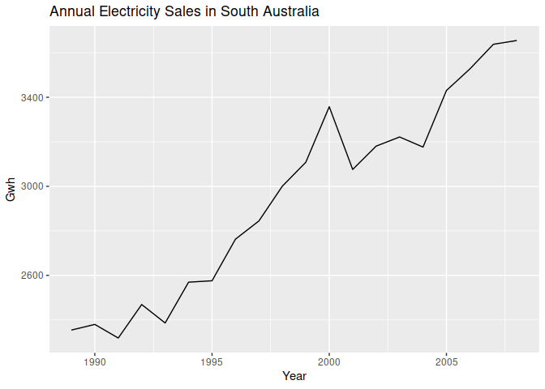
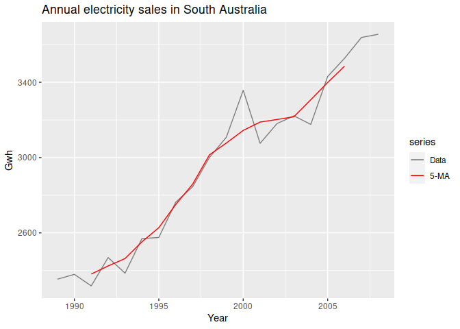
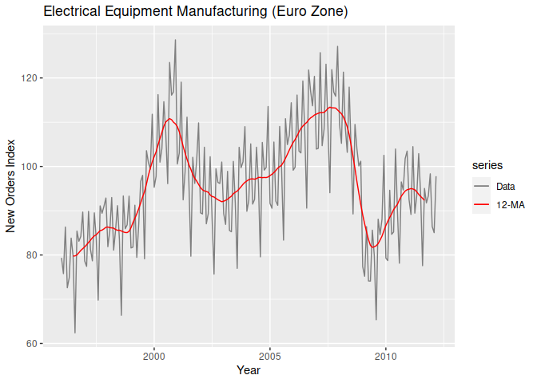

Moving Averages
================

- <a href="#moving-average-smoothing"
  id="toc-moving-average-smoothing">Moving Average Smoothing</a>
- <a href="#moving-average" id="toc-moving-average">Moving Average</a>

[Scott Burk’s
Video](https://www.youtube.com/watch?v=QZtfvXH6mh4&list=PLX-TyAzMwGs-I3i5uiCin37VFMSy4c50F&index=8)

# Moving Average Smoothing

- Moving Average of order $m$

$$\hat{T}_t=\frac{1}{m} \sum_{j=-k}^k y_{t+j}$$

- Weighted Moving Averages

$$\hat{T}_t=\frac{1}{m} \sum_{j=-k}^k a_jy_{t+j}$$

``` r
library(fpp2)
```

    ## Registered S3 method overwritten by 'quantmod':
    ##   method            from
    ##   as.zoo.data.frame zoo

    ## ── Attaching packages ────────────────────────────────────────────── fpp2 2.5 ──

    ## ✔ ggplot2   3.4.1     ✔ fma       2.5  
    ## ✔ forecast  8.20      ✔ expsmooth 2.3

    ## 

``` r
library(ggplot2)
```

**The Data**

``` r
autoplot(elecsales) +
  xlab("Year") + ylab("Gwh") +
  ggtitle("Annual Electricity Sales in South Australia")
```

<!-- -->

# Moving Average

``` r
ma(elecsales, 5)
```

    ## Time Series:
    ## Start = 1989 
    ## End = 2008 
    ## Frequency = 1 
    ##  [1]       NA       NA 2381.530 2424.556 2463.758 2552.598 2627.700 2750.622
    ##  [9] 2858.348 3014.704 3077.300 3144.520 3188.700 3202.320 3216.940 3307.296
    ## [17] 3398.754 3485.434       NA       NA

``` r
autoplot(elecsales, series = "Data") +
  autolayer(ma(elecsales, 5), series = "5-MA") +
  xlab("Year") + ylab("Gwh") +
  ggtitle("Annual electricity sales in South Australia") +
  scale_color_manual(values = c("Data" = "grey50", "5-MA" = "red"),
                     breaks = c("Data", "5-MA"))
```

    ## Warning: Removed 4 rows containing missing values (`geom_line()`).

<!-- -->

``` r
autoplot(elecequip, series = "Data") +
  autolayer(ma(elecequip, 12), series = "12-MA") +
  xlab("Year") + ylab("New Orders Index") +
  ggtitle("Electrical Equipment Manufacturing (Euro Zone)") +
  scale_color_manual(values = c("Data" = "grey50", "12-MA" = "red"),
                     breaks = c("Data", "12-MA"))
```

    ## Warning: Removed 12 rows containing missing values (`geom_line()`).

<!-- -->

This removes variability from the data.

**NB** using odd order makes the average symmetric
