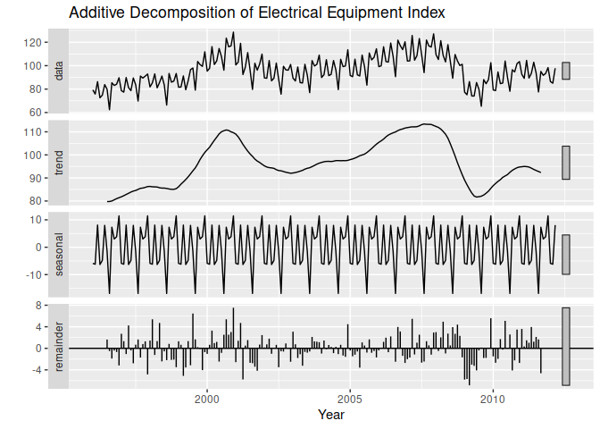
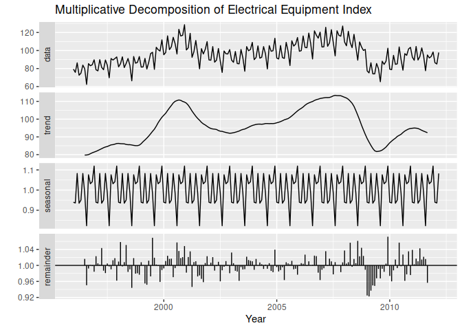
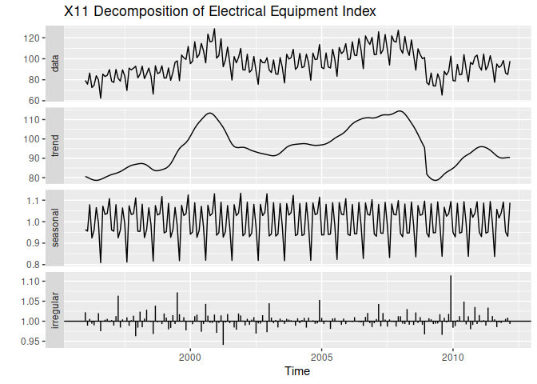

Classical Decomposition: Additive, Multiplicative, X11
================

- <a href="#additive-decomposition"
  id="toc-additive-decomposition">Additive Decomposition</a>
- <a href="#multiplicative-decomposition"
  id="toc-multiplicative-decomposition">Multiplicative Decomposition</a>
- <a href="#x11-decomposition" id="toc-x11-decomposition">X11
  Decomposition</a>

[Scott Burk’s
Video](https://www.youtube.com/watch?v=1zMvAKX2xeQ&list=PLX-TyAzMwGs-I3i5uiCin37VFMSy4c50F&index=10)
[Scott Burk’s
Video](https://www.youtube.com/watch?v=1zMvAKX2xeQ&list=PLX-TyAzMwGs-I3i5uiCin37VFMSy4c50F&index=10)

``` r
library(fpp2)
```

    ## Registered S3 method overwritten by 'quantmod':
    ##   method            from
    ##   as.zoo.data.frame zoo

    ## ── Attaching packages ────────────────────────────────────────────── fpp2 2.5 ──

    ## ✔ ggplot2   3.4.1     ✔ fma       2.5  
    ## ✔ forecast  8.20      ✔ expsmooth 2.3

    ## 

# Additive Decomposition

- Estimate Trend: $T_t$
- Calculate the De-trended Series: $y_t-T_t$
- Estimate Seasonal Components: $S_t$
- Remainder: $R_t=y_t-T_t-S_t$

``` r
elecequip %>% 
  decompose(type = "additive") %>%
    autoplot() +
    xlab("Year") +
    ggtitle("Additive Decomposition of Electrical Equipment Index")
```

<!-- -->

# Multiplicative Decomposition

- Estimate Trend: $T_t$
- Calculate the De-trended Series: $\frac{y_t}{T_t}$
- Estimate Seasonal Components: $S_t$
- Remainder: $R_t=\frac{y_t}{T_t \times S_t}$

``` r
elecequip %>% 
  decompose(type = "multiplicative") %>%
    autoplot() +
    xlab("Year") +
    ggtitle("Multiplicative Decomposition of Electrical Equipment Index")
```

<!-- -->

``` r
# install.packages("seasonal")
library(seasonal)
```

# X11 Decomposition

- Based on classical decomposition
- Includes additional steps/features
- Trend-cycle estimates available for all observations including end
  points
- Seasonal component allowed to vary slowly over time
- Methods for handling trading day variation, holiday effects, other
  effects of known predictors
- Both additive and multiplicative
- Highly robust to outliers and level shifts in the time series

``` r
elecequip %>%
  seas(x11 = "") -> fit
autoplot(fit) +
  ggtitle("X11 Decomposition of Electrical Equipment Index")
```

<!-- -->
