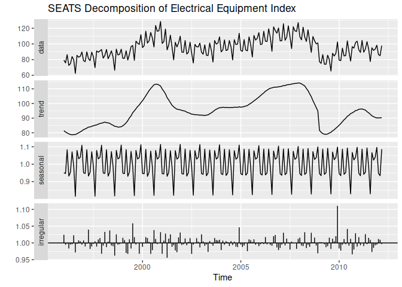
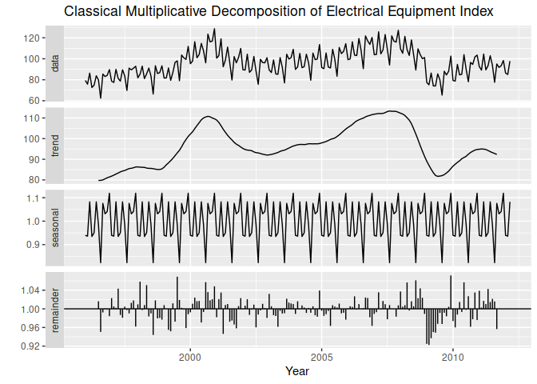

SEATS Decomposition
================

- <a href="#seasonal-extraction-in-arima-time-series-seats"
  id="toc-seasonal-extraction-in-arima-time-series-seats">Seasonal
  Extraction in ARIMA Time Series (SEATS)</a>

[Scott Burk’s
Video](https://www.youtube.com/watch?v=673gF-olKfw&list=PLX-TyAzMwGs-I3i5uiCin37VFMSy4c50F&index=11)

# Seasonal Extraction in ARIMA Time Series (SEATS)

- Developed by the Bank of Spain
- Widely used by government agencies globally
- Applicable only to quarterly and monthly data
- [Seasonal website](http://www.seasonal.website/)
- Includes `seasonal()`, `trendcycle()`, `remainder()`, `seasadj()`

``` r
library(fpp2)
```

    ## Registered S3 method overwritten by 'quantmod':
    ##   method            from
    ##   as.zoo.data.frame zoo

    ## ── Attaching packages ────────────────────────────────────────────── fpp2 2.5 ──

    ## ✔ ggplot2   3.4.1     ✔ fma       2.5  
    ## ✔ forecast  8.20      ✔ expsmooth 2.3

    ## 

``` r
library(seasonal)
```

``` r
elecequip %>%
  seas() %>%
    autoplot() +
    ggtitle("SEATS Decomposition of Electrical Equipment Index")
```

<!-- -->

``` r
elecequip %>% 
  decompose(type = "multiplicative") %>%
    autoplot() +
    xlab("Year") +
    ggtitle("Classical Multiplicative Decomposition of Electrical Equipment Index")
```

<!-- -->
