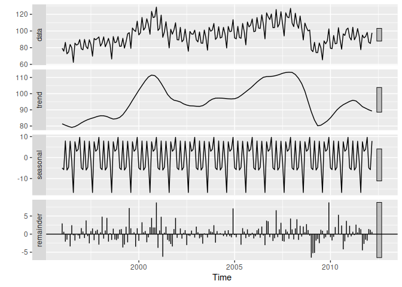
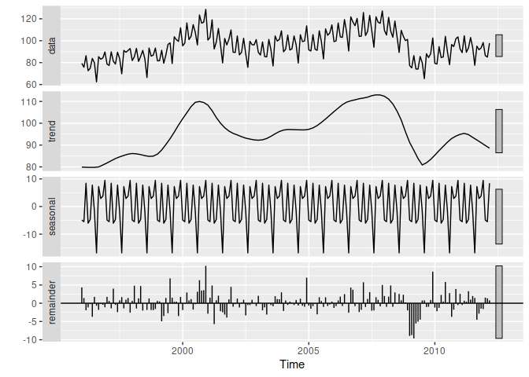
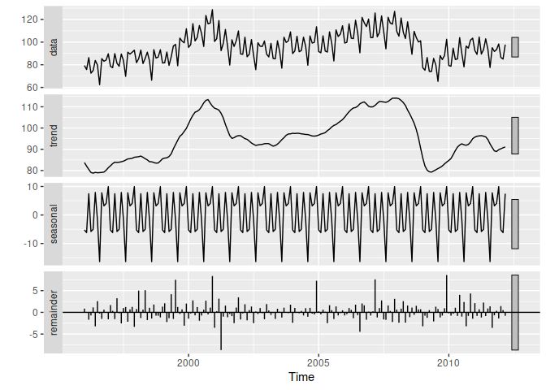
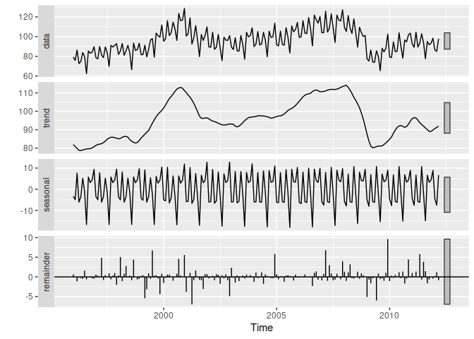
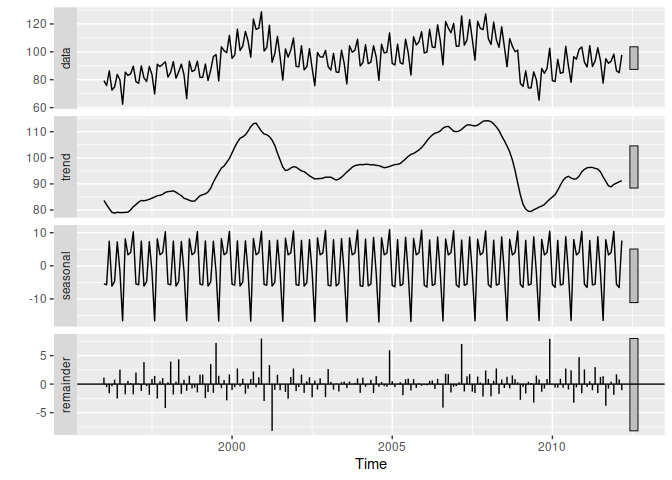

Seasonal and Trend Decomposition with Loess (STL)
================

[Scott Burk’s
Video](https://www.youtube.com/watch?v=DZ403FNW2YI&list=PLX-TyAzMwGs-I3i5uiCin37VFMSy4c50F&index=12)

- Handles any type of seasonality, not just monthly and quarterly
- The seasonal component can vary over time with a rate of change
  controlled by the user
- The smoothness of the trend cycle can be controlled by the user
- It can be robust to outliers
- Does not handle calendar variation automatically
- Only provides additive decompositions

``` r
library(fpp2)
```

    ## Registered S3 method overwritten by 'quantmod':
    ##   method            from
    ##   as.zoo.data.frame zoo

    ## ── Attaching packages ────────────────────────────────────────────── fpp2 2.5 ──

    ## ✔ ggplot2   3.4.1     ✔ fma       2.5  
    ## ✔ forecast  8.20      ✔ expsmooth 2.3

    ## 

``` r
elecequip %>%
  stl(t.window = 13,
      s.window = "periodic",
      robust = TRUE) %>%
  autoplot()
```

<!-- -->

We still have a patch of remainders in 2009 that is unpleasant

``` r
elecequip %>%
  stl(t.window = 17,
      s.window = "periodic",
      robust = TRUE) %>%
  autoplot()
```

<!-- -->

Even worse.

``` r
elecequip %>%
  stl(t.window = 7,
      s.window = "periodic",
      robust = TRUE) %>%
  autoplot()
```

<!-- -->

Much better by adjusting the trend window.

``` r
elecequip %>%
  stl(t.window = 7,
      s.window = 7,
      robust = TRUE) %>%
  autoplot()
```

<!-- -->

Explicitly setting the seasonality window improved the remaineders even
more although there are still sharp spikes.

``` r
elecequip %>%
  stl(t.window = 7,
      s.window = 17,
      robust = TRUE) %>%
  autoplot()
```

<!-- -->
