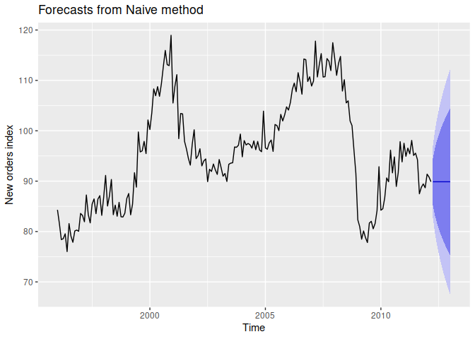
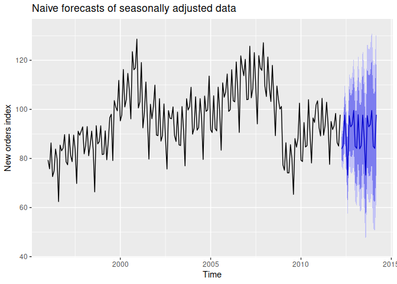

Forecasting with Decomposition
================

[Scott Burk’s
Video](https://www.youtube.com/watch?v=IDjCSDegtGY&list=PLX-TyAzMwGs-I3i5uiCin37VFMSy4c50F&index=13)

- Alternative form of decomposed time series

$$y_t=\hat{S}_t+\hat{A}_t$$

- Where the seasonally adjusted component $\hat{A}_t$ is expressed as

$$\hat{A}_t=\hat{T}_t+\hat{R}_t$$

- Or the multiplicative decomposition expressed

$$y_t=\hat{S}_t\hat{A}_t$$

- Where

$$\hat{A}_t=\hat{T}_t\hat{R}_t$$

- To forecast the decomposed series forecast the seasonal component and
  the seasonally adjusted component seperately.

``` r
library(fpp2)
```

    ## Registered S3 method overwritten by 'quantmod':
    ##   method            from
    ##   as.zoo.data.frame zoo

    ## ── Attaching packages ────────────────────────────────────────────── fpp2 2.5 ──

    ## ✔ ggplot2   3.4.1     ✔ fma       2.5  
    ## ✔ forecast  8.20      ✔ expsmooth 2.3

    ## 

Decompose Seasonal ($S$) and Adjusted Seasonal ($A$)

``` r
fit <- stl(elecequip,
           t.window = 13,
           s.window = "periodic",
           robust = TRUE)

fit %>% seasadj() %>% naive() %>%
  autoplot() +
  guides(colour = guide_legend(title = "Forecast")) +
  labs(level = "Level") +
  ylab("New orders index") 
```

<!-- -->

``` r
fit %>% forecast(method = "naive") %>%
  autoplot() +
  ylab("New orders index")
```

<!-- -->
