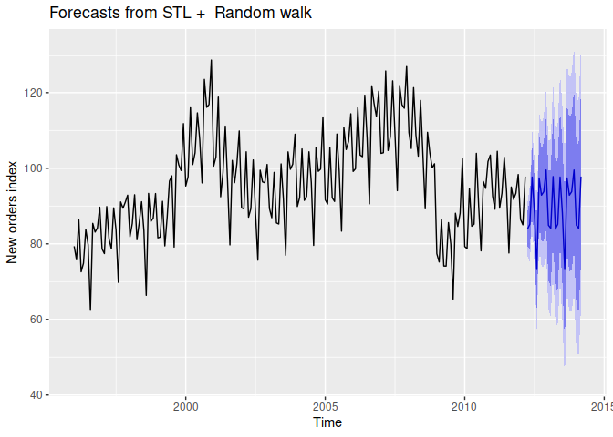

Forecasting with Decomposition
================

[Scott Burk’s
Video](https://www.youtube.com/watch?v=IDjCSDegtGY&list=PLX-TyAzMwGs-I3i5uiCin37VFMSy4c50F&index=13)

- Alternative form of decomposed time series

$$y_t=\hat{S}_t+\hat{A}_t$$

- Where the seasonally adjusted component $\hat{A}_t$ is expressed as

$$\hat{A}_t=\hat{T}_t+\hat{R}_t$$

- Or the multiplicative decomposition expressed

$$y_t=\hat{S}_t\hat{A}_t$$

- Where

$$\hat{A}_t=\hat{T}_t\hat{R}_t$$

- To forecast the decomposed series forecast the seasonal component and
  the seasonally adjusted component seperately.

``` r
library(fpp2)
```

    ## Registered S3 method overwritten by 'quantmod':
    ##   method            from
    ##   as.zoo.data.frame zoo

    ## ── Attaching packages ────────────────────────────────────────────── fpp2 2.5 ──

    ## ✔ ggplot2   3.4.1     ✔ fma       2.5  
    ## ✔ forecast  8.20      ✔ expsmooth 2.3

    ## 

Decompose Seasonal ($S$) and Adjusted Seasonal ($A$)

``` r
fit <- stl(elecequip,
           t.window = 13,
           s.window = "periodic",
           robust = TRUE)

fit %>% seasadj() %>% naive() %>%
  autoplot() +
  guides(colour = guide_legend(title = "Forecast")) +
  labs(level = "Level") +
  ylab("New orders index") 
```

<!-- -->

``` r
fit %>% forecast(method = "naive") %>%
  autoplot() +
  ylab("New orders index")
```

<!-- -->

``` r
fcast <- stlf(elecequip, method = "naive")
fcast
```

    ##          Point Forecast    Lo 80     Hi 80    Lo 95     Hi 95
    ## Apr 2012       84.21997 80.17251  88.26743 78.02992  90.41003
    ## May 2012       84.68296 78.95899  90.40693 75.92890  93.43702
    ## Jun 2012       99.13929 92.12889 106.14970 88.41780 109.86078
    ## Jul 2012       88.23952 80.14461  96.33444 75.85942 100.61963
    ## Aug 2012       73.49359 64.44320  82.54399 59.65221  87.33497
    ## Sep 2012       96.61949 86.70528 106.53370 81.45702 111.78196
    ## Oct 2012       92.61557 81.90700 103.32414 76.23822 108.99291
    ## Nov 2012       93.86149 82.41355 105.30944 76.35338 111.36961
    ## Dec 2012      101.01364 88.87126 113.15602 82.44348 119.58380
    ## Jan 2013       83.85479 71.05561  96.65398 64.28013 103.42946
    ## Feb 2013       82.41238 68.98848  95.83628 61.88229 102.94247
    ## Mar 2013       97.80000 83.77919 111.82081 76.35702 119.24298
    ## Apr 2013       84.21997 69.62665  98.81329 61.90142 106.53853
    ## May 2013       84.68296 69.53876  99.82717 61.52190 107.84402
    ## Jun 2013       99.13929 83.46355 114.81503 75.16532 123.11327
    ## Jul 2013       88.23952 72.04969 104.42936 63.47931 112.99974
    ## Aug 2013       73.49359 56.80549  90.18169 47.97135  99.01584
    ## Sep 2013       96.61949 79.44758 113.79140 70.35731 122.88167
    ## Oct 2013       92.61557 74.97310 110.25803 65.63375 119.59739
    ## Nov 2013       93.86149 75.76071 111.96228 66.17873 121.54426
    ## Dec 2013      101.01364 82.46585 119.56143 72.64725 129.38003
    ## Jan 2014       83.85479 64.87053 102.83906 54.82087 112.88872
    ## Feb 2014       82.41238 63.00145 101.82331 52.72592 112.09884
    ## Mar 2014       97.80000 77.97158 117.62842 67.47505 128.12495
