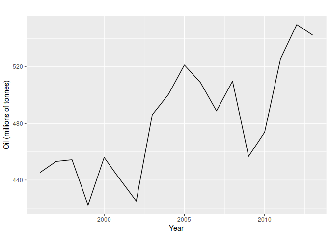

Forecasting with Exponential Smoothing
================

[Scott Burk’s
Video](https://www.youtube.com/watch?v=aquvCL3_6pI&list=PLX-TyAzMwGs-I3i5uiCin37VFMSy4c50F&index=14)

- $0 <= \alpha <=1$ is the smoothing parameter
  - Larger $\alpha$ gives more weight on $y_T$ and quicker dampening,
    smaller is closer to equal weight
- Weighted Averages of Past Observations
- Weights decay exponentially
- Simple Exponential Smoothing (SES)
  - Applicable when no clear trend or seasonal pattern exists
- Weighted Average method

$$
\begin{equation*}
\begin{aligned}
\hat{y}_{2/1} &= \alpha y_1+ (1- \alpha)l_0 \\
\hat{y}_{3/2} &= \alpha y_2+ (1- \alpha)\hat{y}_{2/1} \\
\hat{y}_{4/3} &= \alpha y_3+ (1- \alpha)\hat{y}_{3/2} \\
\vdots \\
\hat{y}_{T/T-1} &= \alpha y_{T-1}+ (1- \alpha)\hat{y}_{T-1/T-2} \\
\hat{y}_{T+1/T} &= \alpha y_T+ (1- \alpha)\hat{y}_{T/T-1} \\
\end{aligned}
\end{equation*}
\hat{y}_{T+1/T} = \sum_{j=0}^{T-1} \alpha (1-\alpha)^jy_{T-j} + (1-\alpha)^Tl_0 
$$

- Component Form

  - Forecast equation: $\hat{y}_{t-h/t}=L_t$

  - Smoothing equation: $L_t=\alpha y_t + (1-\alpha)L_{t-1}$

- Flat Forecasts

$$\hat{y}_{T+h/T}=\hat{y}_{T+1/T}=l_T, \quad  h = 2,3,\dots$$

- Other variations
  - Naive method
  - Average method
- Optimization to determine alpha and initial level

$$SSE = \sum_{t=1}^T(y_t-\hat{y}_{t/t-1})^2=\sum_{t=1}^Te_t^2$$

``` r
library(fpp2)
```

    ## Registered S3 method overwritten by 'quantmod':
    ##   method            from
    ##   as.zoo.data.frame zoo

    ## ── Attaching packages ────────────────────────────────────────────── fpp2 2.5 ──

    ## ✔ ggplot2   3.4.1     ✔ fma       2.5  
    ## ✔ forecast  8.20      ✔ expsmooth 2.3

    ## 

``` r
oildata <- window(oil, start = 1996)
autoplot(oildata) +
  ylab("Oil (millions of tonnes)") +
  xlab("Year")
```

<!-- -->

This data has no trend or seasonality so lends itself to exponential
smoothing.

Estimate the parameters:

``` r
fc <- ses(oildata, h=5)
round(accuracy(fc), 2)
```

    ##               ME  RMSE   MAE MPE MAPE MASE  ACF1
    ## Training set 6.4 28.12 22.26 1.1 4.61 0.93 -0.03

``` r
oilest <- ses(oildata, initial = "simple", h = 4)
oilest_alpha <- oilest$model$par["alpha"]
oilest_alpha
```

    ##     alpha 
    ## 0.8346187

``` r
forecast(fc)
```

    ##      Point Forecast    Lo 80    Hi 80    Lo 95    Hi 95
    ## 2014       542.6806 504.4541 580.9070 484.2183 601.1429
    ## 2015       542.6806 492.9073 592.4539 466.5589 618.8023
    ## 2016       542.6806 483.5747 601.7864 452.2860 633.0752
    ## 2017       542.6806 475.5269 609.8343 439.9778 645.3834
    ## 2018       542.6806 468.3452 617.0159 428.9945 656.3667

``` r
summary(fc)
```

    ## 
    ## Forecast method: Simple exponential smoothing
    ## 
    ## Model Information:
    ## Simple exponential smoothing 
    ## 
    ## Call:
    ##  ses(y = oildata, h = 5) 
    ## 
    ##   Smoothing parameters:
    ##     alpha = 0.8339 
    ## 
    ##   Initial states:
    ##     l = 446.5868 
    ## 
    ##   sigma:  29.8282
    ## 
    ##      AIC     AICc      BIC 
    ## 178.1430 179.8573 180.8141 
    ## 
    ## Error measures:
    ##                    ME     RMSE     MAE      MPE     MAPE      MASE        ACF1
    ## Training set 6.401975 28.12234 22.2587 1.097574 4.610635 0.9256774 -0.03377748
    ## 
    ## Forecasts:
    ##      Point Forecast    Lo 80    Hi 80    Lo 95    Hi 95
    ## 2014       542.6806 504.4541 580.9070 484.2183 601.1429
    ## 2015       542.6806 492.9073 592.4539 466.5589 618.8023
    ## 2016       542.6806 483.5747 601.7864 452.2860 633.0752
    ## 2017       542.6806 475.5269 609.8343 439.9778 645.3834
    ## 2018       542.6806 468.3452 617.0159 428.9945 656.3667
