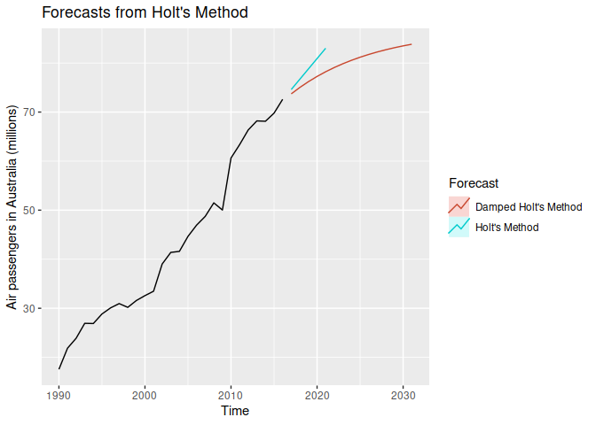
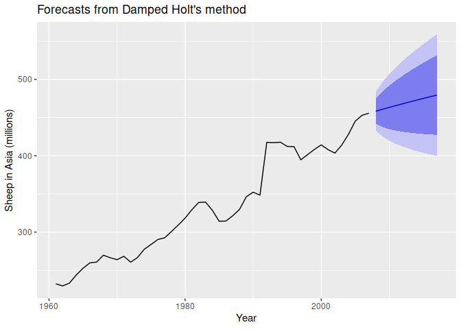

Holt’s Linear Trend
================

- <a href="#the-method" id="toc-the-method">The Method</a>
- <a href="#damped-trend-methods" id="toc-damped-trend-methods">Damped
  trend methods</a>
- <a href="#combine-with-smoothing"
  id="toc-combine-with-smoothing">Combine with smoothing</a>
  - <a href="#cross-validation" id="toc-cross-validation">Cross
    Validation</a>
  - <a href="#mean-squared-error" id="toc-mean-squared-error">Mean squared
    error</a>
  - <a href="#mean-absolute-error" id="toc-mean-absolute-error">Mean
    Absolute Error</a>

[Scott Burk’s
Video](https://www.youtube.com/watch?v=Nrt3kNEHb4I&list=PLX-TyAzMwGs-I3i5uiCin37VFMSy4c50F&index=15)

# The Method

Consists of a forecast equation and two smoothing equations

$$
\begin{align}
\text{Forecast equation} \quad & \hat{y}_{t+h/t} = l_t + hb_t \\
\text{Level equation} \quad & l_t = \alpha y_t+(1-\alpha)(l_{t-1} + b_{t-1}) \\
\text{Trend equation} \quad & b_t=\beta^*(l_1-l_{1-t})+(1-\beta^*)b_{t-1}
\end{align}
$$

$\alpha$ and $\beta^*$ are smoothing functions with domain $[0,1]$

``` r
library(fpp2)
```

    ## Registered S3 method overwritten by 'quantmod':
    ##   method            from
    ##   as.zoo.data.frame zoo

    ## ── Attaching packages ────────────────────────────────────────────── fpp2 2.5 ──

    ## ✔ ggplot2   3.4.1     ✔ fma       2.5  
    ## ✔ forecast  8.20      ✔ expsmooth 2.3

    ## 

``` r
ausair
```

    ## Time Series:
    ## Start = 1970 
    ## End = 2016 
    ## Frequency = 1 
    ##  [1]  7.31870  7.32660  7.79560  9.38460 10.66470 11.05510 10.86430 11.30650
    ##  [9] 12.12230 13.02250 13.64880 13.21950 13.18790 12.60150 13.23680 14.41210
    ## [17] 15.49730 16.88020 18.81630 15.11430 17.55340 21.86010 23.88660 26.92930
    ## [25] 26.88850 28.83140 30.07510 30.95350 30.18570 31.57970 32.57757 33.47740
    ## [33] 39.02158 41.38643 41.59655 44.65732 46.95177 48.72884 51.48843 50.02697
    ## [41] 60.64091 63.36031 66.35527 68.19795 68.12324 69.77935 72.59770

``` r
air <- window(ausair, start = 1990)
fc <- holt(air, h=5)
summary(fc)
```

    ## 
    ## Forecast method: Holt's method
    ## 
    ## Model Information:
    ## Holt's method 
    ## 
    ## Call:
    ##  holt(y = air, h = 5) 
    ## 
    ##   Smoothing parameters:
    ##     alpha = 0.8302 
    ##     beta  = 1e-04 
    ## 
    ##   Initial states:
    ##     l = 15.5715 
    ##     b = 2.1017 
    ## 
    ##   sigma:  2.3645
    ## 
    ##      AIC     AICc      BIC 
    ## 141.1291 143.9863 147.6083 
    ## 
    ## Error measures:
    ##                       ME     RMSE     MAE        MPE     MAPE      MASE
    ## Training set 0.008359331 2.182343 1.52892 -0.3244107 3.820787 0.6654839
    ##                     ACF1
    ## Training set -0.01335362
    ## 
    ## Forecasts:
    ##      Point Forecast    Lo 80    Hi 80    Lo 95    Hi 95
    ## 2017       74.60130 71.57106 77.63154 69.96695 79.23566
    ## 2018       76.70304 72.76440 80.64169 70.67941 82.72668
    ## 2019       78.80478 74.13092 83.47864 71.65673 85.95284
    ## 2020       80.90652 75.59817 86.21487 72.78810 89.02494
    ## 2021       83.00826 77.13343 88.88310 74.02348 91.99305

# Damped trend methods

Adds an additional time-dampening parameter $\phi$

$$
\begin{align}
\hat{y}_{t+h/t} &= l_t+(\phi+\phi^2+\dots+\phi^h)g_1 \\
l_t &= \alpha y_t + (1 - \alpha)(l_{t-1} + \phi b_{t-1}) \\
b_t &= \beta^*(l_1 - l_{t-1}) + (1 - \beta^*)\phi b_{t-1})
\end{align}
$$

``` r
fc <- holt(air, h=5)
fc2 <- holt(air, damped = TRUE, phi =  0.9, h = 15)
autoplot(air) +
  autolayer(fc, series = "Holt's Method", PI = FALSE) +
  autolayer(fc2, series = "Damped Holt's Method", PI = FALSE) +
  ggtitle("Forecasts from Holt's Method") +
  ylab("Air passengers in Australia (millions)") +
  guides(colour = guide_legend(title = "Forecast"))
```

<!-- -->

# Combine with smoothing

``` r
autoplot(livestock) +
  xlab("Year") +
  ylab("Sheep in Asia (millions)")
```

<!-- -->

## Cross Validation

``` r
e_ses <- tsCV(livestock, ses, h=1)
e_holt <- tsCV(livestock, holt, h=1)
e_holtd <- tsCV(livestock, holt, damped=TRUE, h=1)
```

`tsCV()` does times series cross-validataion

## Mean squared error

``` r
mean(e_ses^2, na.rm = TRUE)
```

    ## [1] 178.2531

``` r
mean(e_holt^2, na.rm = TRUE)
```

    ## [1] 173.365

``` r
mean(e_holtd^2, na.rm = TRUE)
```

    ## [1] 162.6274

The dampened Holt method gave the least mean squared error

## Mean Absolute Error

``` r
mean(abs(e_ses), na.rm = TRUE)
```

    ## [1] 8.53246

``` r
mean(abs(e_holt), na.rm = TRUE)
```

    ## [1] 8.803058

``` r
mean(abs(e_holtd), na.rm = TRUE)
```

    ## [1] 8.024192

``` r
fc <- holt(livestock, damped=TRUE)
fc
```

    ##      Point Forecast    Lo 80    Hi 80    Lo 95    Hi 95
    ## 2008       458.3355 441.8760 474.7951 433.1628 483.5083
    ## 2009       460.8784 437.5990 484.1578 425.2757 496.4811
    ## 2010       463.3697 434.8551 491.8844 419.7603 506.9792
    ## 2011       465.8107 432.8806 498.7407 415.4485 516.1728
    ## 2012       468.2022 431.3806 505.0237 411.8884 524.5159
    ## 2013       470.5452 430.2041 510.8864 408.8488 532.2417
    ## 2014       472.8409 429.2620 516.4198 406.1927 539.4891
    ## 2015       475.0900 428.4964 521.6837 403.8312 546.3489
    ## 2016       477.2937 427.8676 526.7198 401.7029 552.8844
    ## 2017       479.4527 427.3466 531.5588 399.7633 559.1421

``` r
fc$model
```

    ## Damped Holt's method 
    ## 
    ## Call:
    ##  holt(y = livestock, damped = TRUE) 
    ## 
    ##   Smoothing parameters:
    ##     alpha = 0.9999 
    ##     beta  = 3e-04 
    ##     phi   = 0.9798 
    ## 
    ##   Initial states:
    ##     l = 223.35 
    ##     b = 6.9046 
    ## 
    ##   sigma:  12.8435
    ## 
    ##      AIC     AICc      BIC 
    ## 427.6370 429.7370 438.7379

$\alpha$ and $\phi$ are close to 1 and $\beta$ is close to 0

``` r
autoplot(fc) +
  xlab("Year") +
  ylab("Sheep in Asia (millions)")
```

<!-- -->
